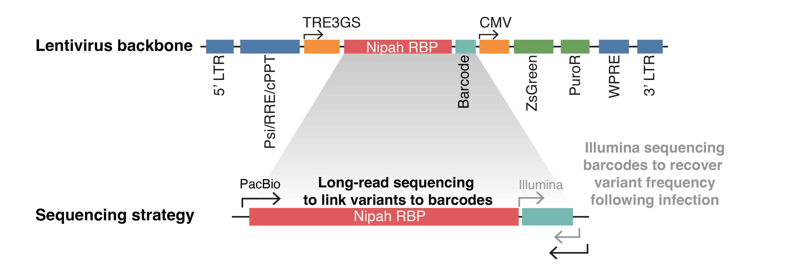

# Pipeline Information

The lentivirus-based deep mutational scanning platform relies on obtaining relative frequencies of different receptor binding protein variants that enter cells after applying selection to the libraries. By comparing mutation frequencies before and after selections, we can determine the effects of mutations on different phenotypes.

Calculating the relative frequencies of thousands of variants is not trivial. We rely on two different sequencing technologies to obtain the necessary data.
- PacBio long-read sequencing to link barcodes to specific mutations in the receptor binding protein.
- Illumina short-read sequencing to obtain the relative frequencies of barcodes in each selection experiment.



<div style="text-align: center; color: grey; font-size: smaller;">Schematic of lentivirus vector used in deep mutational scanning experiments (top), along with sequencing strategy (bottom). </div>

Because PacBio sequencing is expensive and lower throughput, we only sequenced the variant libraries with this technology once. Full-length consensus sequences of the receptor binding protein and associated barcodes are assembled, while discarding low-quality reads. From these assembled consensus sequences we build a codon-variant lookup table, enabling us to match barcodes to specific mutations in the receptor binding protein. All subsequent Illumina sequencing of selection experiments use this lookup table to estimate mutational effects from barcode sequencing data alone. Our generated pseudovirus libraries consist of 60,000 to 80,000 unique variants. Each unique variant is sequenced hundreds of times with Illumina to get accurate frequency measurements. 

Most of these computationally intensive steps were analyzed with [`dms-vep-pipeline-3`](https://github.com/dms-vep/dms-vep-pipeline-3){target="_self"}. This pipeline utilizes the [`alignparse`](https://jbloomlab.github.io/alignparse/){target="_self"} package. Each step, along with the associated jupyter notebooks are listed below. 

## Build Pacbio Sequences 

<a href="notebooks/build_pacbio_consensus.html" target="_self">PacBio consensus sequences notebook</a>

This notebook builds the Pacbio consensus sequences used to link specific mutations in the receptor binding protein with a unique 16 bp barcode. [Parameters](https://github.com/dms-vep/Nipah_Malaysia_RBP_DMS/blob/master/config.yaml){target="_self"} used are:
```
max_minor_sub_frac=0.2
max_minor_indel_frac=0.2
min_support=3
```

These parameters filter consensus sequences generated from Pacbio CCS sequencing and assembly. If an assembled RBP sequence has a mutation or indel in more than 20% of the reads, it will be discarded. Consensus sequences must have at least three reads to be included as variants.

Using [alignparse](https://jbloomlab.github.io/alignparse/){target="_self"}, reads were mapped to a [reference sequence](https://github.com/dms-vep/Nipah_Malaysia_RBP_DMS/blob/master/data/PacBio_amplicon.gb){target="_self"}, and clipped based on parameters in this [config](https://github.com/dms-vep/Nipah_Malaysia_RBP_DMS/blob/master/data/PacBio_feature_parse_specs.yaml){target="_self"} file.


## Analyze PacBio CCS Reads
<a href="notebooks/analyze_pacbio_ccs.html" target="_self">Analyze Pacbio CCS reads notebook</a>

Reports information about CCS read filtering.


## Build Codon Variants Notebook

<a href="notebooks/build_codon_variants.html" target="_self">Build codon variants notebook</a>

Builds the codon-variant table from PacBio consensus sequences that links barcodes and RBP mutations. Displays information about the number of mutations and variants present in each library.

[Link to codon-variant table .csv file](https://github.com/dms-vep/Nipah_Malaysia_RBP_DMS/blob/master/results/variants/codon_variants.csv){target="_self"}


## Illumina Variant Counts
Once the barcodes are linked to mutations in the codon-variant table, all sequencing data is generated with Illumina on a small sequence fragment to obtain the relative frequencies of barcodes in each selection experiment. The config file linked below specifies the parameters used for converting barcode counts to functional scores, which are used to estimate cell entry.  

<a href="notebooks/analyze_variant_counts.html" target="_self">Analysis of variant counts notebook</a>

[Link to raw barcode count .csv files](https://github.com/dms-vep/Nipah_Malaysia_RBP_DMS/tree/master/results/barcode_counts){target="_self"}

[Link to functional selection config file](https://github.com/dms-vep/Nipah_Malaysia_RBP_DMS/blob/master/data/func_effects_config.yml){target="_self"}

## Filtering Selection Data

<a href="notebooks/filter_data.html" target="_self">Filtering notebook</a>

Once the effects of mutations on different phenotypes have been calculated, we perform a data filtering step to remove low confidence measurements. The filtering parameters are contained within the [nipah_config.yaml](https://github.com/dms-vep/Nipah_Malaysia_RBP_DMS/blob/master/nipah_config.yaml){target="_self"} file. More information about these parameters are listed in the notebook. In brief, we require mutations to be present in at least two barcodes, and have low variance between selection replicates.

## Filtered Data
::: warning These data have been filtered and are the best choice for anyone interested in analyzing the data themselves. For unfiltered raw `.csv` files of mutational effects on different phenotypes, go to individual pages to view and download.
### Cell Entry

[CHO-bEFNB2 entry filtered (.csv)](https://github.com/dms-vep/Nipah_Malaysia_RBP_DMS/blob/master/results/filtered_data/public_filtered/RBP_mutation_effects_cell_entry_CHO-bEFNB2.csv){target="_self"}

[CHO-bEFNB3 entry filtered (.csv)](https://github.com/dms-vep/Nipah_Malaysia_RBP_DMS/blob/master/results/filtered_data/public_filtered/RBP_mutation_effects_cell_entry_CHO-bEFNB3.csv){target="_self"}

### Receptor Binding

[bEFNB2 monomeric binding filtered (.csv)](https://github.com/dms-vep/Nipah_Malaysia_RBP_DMS/blob/master/results/filtered_data/public_filtered/RBP_mutation_effects_bEFNB2_binding.csv){target="_self"}

[bEFNB3 dimeric binding filtered (.csv)](https://github.com/dms-vep/Nipah_Malaysia_RBP_DMS/blob/master/results/filtered_data/public_filtered/RBP_mutation_effects_bEFNB3_binding.csv){target="_self"}

### Antibody Escape

[Antibody escape filtered (.csv)](https://github.com/dms-vep/Nipah_Malaysia_RBP_DMS/blob/master/results/filtered_data/public_filtered/RBP_mutation_effects_antibody_escape.csv){target="_self"}

:::


## Miscellaneous Notebooks

<a href="notebooks/library_correlations.html" target="_self">Notebook for finding correlations between libraries and making histogram of variants</a>

<a href="notebooks/make_nipah_phylogeny_baltic.html" target="_self">Notebook for making a Nipah phylogeny</a>

<a href="notebooks/mapping_site_level.html" target="_self">Notebook for making specific file formats (.defattr), to map site-averaged scores onto protein structures in Chimera</a>

<a href="notebooks/receptor_distance.html" target="_self">Notebook for calculating atomic distances between residues from a PDB file</a>

<a href="notebooks/henipavirus_conservation.html" target="_self">Notebook for finding variable sites in Nipah or Henipavirus alignments</a>

